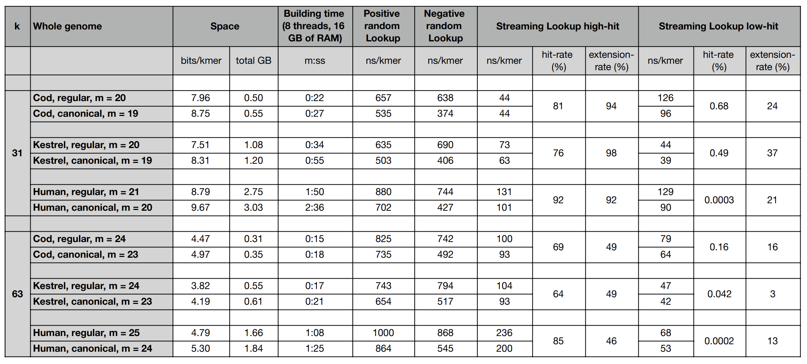

[](https://doi.org/10.5281/zenodo.7239205)

Benchmarks
----------

For these benchmarks we used the whole genomes of the following organisms:

- Gadus Morhua ("Cod")
- Falco Tinnunculus ("Kestrel")
- Homo Sapiens ("Human")

for k = 31 and 63.

The datasets and queries used in these benchmarks can be downloaded
by running the script

```
bash download-datasets.sh
```

To run the benchmarks, from within the `build` directory, run

```
bash ../script/build.sh [prefix]
bash ../script/bench.sh [prefix]
bash ../script/streaming-query-high-hit.sh [prefix]
bash ../script/streaming-query-low-hit.sh [prefix]
```

where `[prefix]` should be replaced by a suitable basename, e.g., the current date.

These are the results obtained on 22/09/25 (see logs [here](results-22-09-25))
on a machine equipped with an Intel Xeon W-2245 CPU @ 3.90GHz, and running Ubuntu 18.04.6.
The code was compiled with `gcc` 10.3.




## Linux with Intel x86 vs. Apple with M1 arm

Very interestingly, random lookup queries on an Apple M1 arm processor are much faster than
the same queries (actually, the queries are random, drawn uniformly from the set of indexed
kmers using a randomly generated seed) under Linux with an Intel x86 processor.
This matches the same observation made for PTHash, [here](https://github.com/jermp/pthash/tree/master/benchmarks).
(The performance for streaming queries is the same, instead.)

For access queries and negative lookups, the trend is the opposite.

#### Linux, Intel x86

Taken from [these logs](results-22-09-25).

	./sshash bench -i human.k31.sshash
	avg_nanosec_per_positive_lookup 880.499
	avg_nanosec_per_negative_lookup 744.67
	avg_nanosec_per_access 512.398

	./sshash bench -i human.k31.canon.sshash
	avg_nanosec_per_positive_lookup 702.591
	avg_nanosec_per_negative_lookup 427.235
	avg_nanosec_per_access 510.499

#### Apple, M1 arm

	./sshash bench -i human.k31.sshash
	avg_nanosec_per_positive_lookup 578.065
	avg_nanosec_per_negative_lookup 656.382
	avg_nanosec_per_access 882.288

	./sshash bench -i human.k31.canon.sshash
	avg_nanosec_per_positive_lookup 622.091
	avg_nanosec_per_negative_lookup 878.432
	avg_nanosec_per_access 886.565
