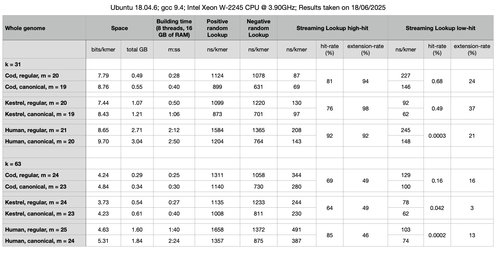

[](https://doi.org/10.5281/zenodo.7239205)

Benchmarks
----------

For these benchmarks we used the whole genomes of the following organisms:

- Gadus Morhua ("Cod")
- Falco Tinnunculus ("Kestrel")
- Homo Sapiens ("Human")

for k = 31 and 63.

The datasets and queries used in these benchmarks can be downloaded
by running the script

```
bash donwload-datasets.sh
```

To run the benchmarks, from within the `build` directory, run

```
bash ../script/build.sh [prefix]
bash ../script/bench.sh [prefix]
bash ../script/streaming-query-high-hit.sh [prefix]
bash ../script/streaming-query-low-hit.sh [prefix]
```

where `[prefix]` should be replaced by a suitable basename, e.g., the current date.

These are the results obtained on 18/06/25 (see logs [here](results-18-06-25)).


