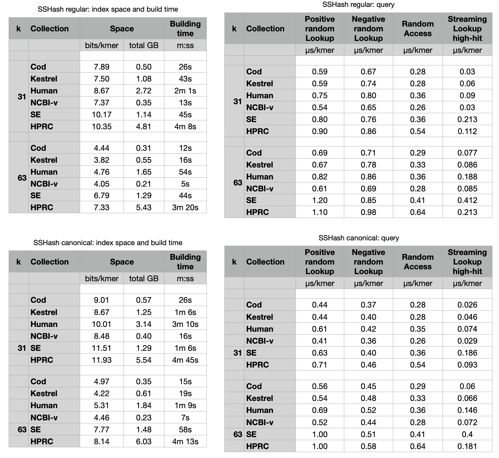

Benchmarks
----------

For these benchmarks we used the datasets available here
[https://zenodo.org/records/17582116](https://zenodo.org/records/17582116).

To run the benchmarks, from within the `build` directory, run

    python3 ../script/build.py <log_label> <input_datasets_dir> <output_index_dir>
    python3 ../script/bench.py <log_label> <input_index_dir>
    python3 ../script/streaming-query-high-hit.py <log_label> <input_index_dir> <input_queries_dir>

where `<log_label>` should be replaced by a suitable basename, e.g., the current date.

These are the results obtained on 21/01/26 (see logs [here](results-21-01-26))
on a machine equipped with an AMD Ryzen Threadripper PRO 7985WX processor clocked at 5.40GHz.
The code was compiled with `gcc` 13.3.0.

The indexes were build with a max RAM usage of 16 GB and 64 threads.
Queries were run using one thread, instead.

The results can be exported to CSV format with

    python3 ../script/print_csv.py ../benchmarks/results-10-11-25/k31
    python3 ../script/print_csv.py ../benchmarks/results-10-11-25/k63
